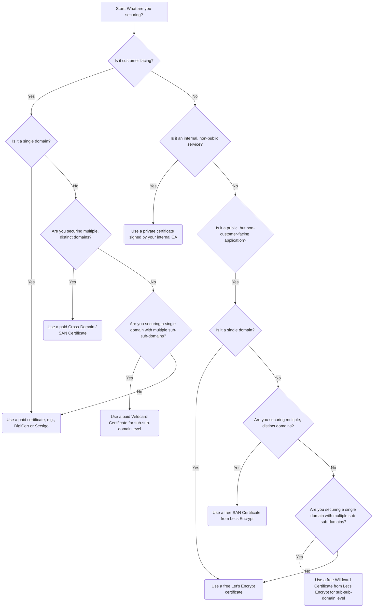

# DevOps Guideline for Certificate Generation

This guide outlines best practices for certificate generation in a DevOps environment, focusing on different types of certificates and their appropriate use cases.

## Public vs. Private Certificates

**Public certificates** are signed by a trusted Certificate Authority (CA), like DigiCert, Sectigo, or Let's Encrypt. They're essential for anything accessible by the general public, as they verify the identity of a server and encrypt data in transit. Your web browsers and operating systems automatically trust these CAs, ensuring a seamless user experience.

**Private certificates** are signed by your organization's own internal CA. They are used for internal, non-public-facing services and are not trusted by external browsers. Examples include communication between microservices, internal APIs, or internal tools. Using private certificates for internal services improves security by preventing man-in-the-middle attacks and ensures that traffic within your network remains encrypted.

---

## Wildcard and Specific Domain Certificates

A wildcard certificate is a single certificate that secures multiple subdomains under a domain. For instance, a certificate for `*.example.com` would secure `www.example.com`, `api.example.com`, and `blog.example.com`.

**Do not use a wildcard at the sub-domain level** (e.g., `*.sub.example.com`). This practice can introduce security risks and management complexity. Instead, use a specific certificate for each sub-domain, such as `app.sub.example.com` and `api.sub.example.com`, or a wildcard at the top level (`*.example.com`) if necessary.

**Use a wildcard certificate at the sub-sub-domain level** (e.g., `*.app.team-a.example.com`). This is useful for environments where you have many dynamically provisioned services under a specific team or application, like `service1.app.team-a.example.com` and `service2.app.team-a.example.com`. This approach simplifies certificate management for a large number of internal-facing or test environments without compromising security.

---

## Cross-Domain Certificates

A **cross-domain certificate**, also known as a Subject Alternative Name (SAN) certificate, secures multiple distinct domains on a single certificate. For example, a single SAN certificate can cover `www.example.com`, `www.example.org`, and `api.example-a.net`. Use these when a single server or service needs to secure multiple, unrelated domains, which is common in a multi-tenant or consolidated hosting environment. This consolidates certificate management and simplifies deployment.

---

## Free vs. Paid Certificates

Choosing between a free certificate like those from Let's Encrypt and a paid one from a CA like DigiCert or Sectigo depends on the service's audience and purpose.

**Use a free Let's Encrypt public certificate for non-customer-facing applications.** These certificates are great for internal tools, APIs, development environments, and staging servers. They provide the same level of encryption as paid certificates and are free, automated, and widely supported. Let's Encrypt is an excellent choice for a DevOps environment that values speed and automation.

**Use a paid certificate like DigiCert or Sectigo for customer-facing applications.** Paid certificates often come with additional features and benefits that are crucial for a business, such as:

* **Warranties:** Paid CAs offer warranties that protect the end-user or business in the event of a CA-related security breach.
* **Customer support:** Paid CAs provide dedicated support for any issues with certificate issuance or validation.
* **Extended validation (EV) certificates:** Some paid certificates offer a higher level of trust validation, displaying the organization's name in the browser's address bar. While less common now, this can still be a differentiator for certain businesses.
* **Trust and brand reputation:** Using a well-known CA can add a layer of perceived trust for customers.

## Certificate Selection Decision Tree

