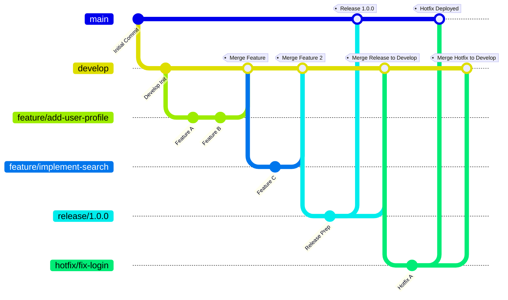
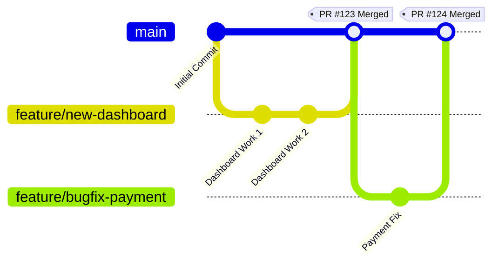

DevOps Best Practice Document: Source Code Management and Branching Policies
============================================================================

Introduction
------------

Effective Source Code Management (SCM) and well-defined branching policies are foundational to successful DevOps practices. They ensure code quality, facilitate collaboration, enable continuous integration and delivery, and provide a clear history of development. This document outlines best practices for SCM, focusing on branching strategies, naming conventions, commit message guidelines, and integration with issue tracking systems like Jira.

For insights into how to name your repositories, please refer to our "DevOps Best Practice Document: Repository Naming Conventions."

1\. Source Code Management Best Practices
-----------------------------------------

At the core, SCM best practices revolve around:

-   **Version Control System (VCS):** Utilizing a robust VCS like Git.

-   **Centralized Source of Truth:** The main branch of the repository serves as the single source of truth for the latest stable code.

-   **Atomic Commits:** Commits should represent a single logical change, making it easier to understand history and revert if necessary.

-   **Frequent Commits:** Developers should commit small, self-contained changes frequently.

-   **Regular Syncing:** Developers should regularly pull changes from the remote repository to minimize merge conflicts.

-   **Code Reviews:** All code changes should undergo a review process before being merged into main integration branches.

-   **Automated Testing:** Integrate automated tests (unit, integration, end-to-end) into the CI/CD pipeline to validate changes.

2\. Branching Strategies
------------------------

Branching strategies define how development teams use branches to manage their codebase. The choice of strategy depends on project size, team structure, release cadence, and complexity.

### 2.1 GitFlow Workflow

GitFlow is a robust branching model designed for managing large projects with scheduled release cycles. It defines a strict branching model with two main branches (`master` and `develop`) and supporting branches for features, releases, and hotfixes.

#### Branches:

-   **`master` (or `main`):** Represents the production-ready code. Only stable, fully tested code is merged here. Releases are tagged from this branch.

-   **`develop`:** Integrates all new features and bug fixes for the next release. This is the primary integration branch.

-   **`feature/*`:** Used for developing new features. They branch off `develop` and merge back into `develop`.

-   **`release/*`:** Used for preparing new production releases. They branch off `develop` and merge into both `master` (or `main`) and `develop`. Only bug fixes specific to the release are allowed here.

-   **`hotfix/*`:** Used for quickly patching production bugs. They branch off `master` (or `main`) and merge back into both `master` (or `main`) and `develop`.

#### GitFlow Diagram (Mermaid):



#### Pros of GitFlow:

-   **Clear Structure:** Well-defined roles for each branch, making it easy to understand the project's state.

-   **Supports Parallel Development:** Allows multiple teams to work on features, releases, and hotfixes concurrently.

-   **Ideal for Scheduled Releases:** Excellent for projects with distinct release cycles and versions.

#### Cons of GitFlow:

-   **Complexity:** Can be overly complex for small teams or projects with continuous delivery.

-   **More Merging:** Requires more frequent merging, which can lead to conflicts if not managed well.

### 2.2 GitHub Flow

GitHub Flow is a lightweight, continuous delivery-oriented branching model. It's simpler than GitFlow and focuses on a single main branch and short-lived feature branches.

#### Branches:

-   **`main` (or `master`):** Always deployable. All development flows into this branch.

-   **`feature/*` (or any descriptive name):** Created for any new work (features, bug fixes, experiments). They branch off `main` and are merged back into `main` via Pull Requests.

#### GitHub Flow Diagram (Mermaid):



#### Pros of GitHub Flow:

-   **Simplicity:** Easy to understand and implement, especially for smaller teams or projects.

-   **Continuous Delivery:** Encourages frequent, small deployments, aligning well with CD practices.

-   **Less Overhead:** Fewer long-lived branches mean fewer complex merges.

#### Cons of GitHub Flow:

-   **Less Structured for Releases:** Can be challenging for projects requiring strict versioning or multiple simultaneous releases.

-   **Requires Strong CI/CD:** Relies heavily on automated testing and deployment to ensure `main` is always deployable.

### 2.3 When to Use Which Strategy

-   **Choose GitFlow if:**

    -   Your project has distinct release cycles and versions (e.g., v1.0, v1.1, v2.0).

    -   You need to support multiple versions of the software in production simultaneously.

    -   Your team is large and requires a strict, predictable workflow.

-   **Choose GitHub Flow if:**

    -   You practice Continuous Delivery/Deployment and want to deploy frequently.

    -   Your project is web-based or a SaaS application where the latest version is always active.

    -   Your team prefers a simpler, more agile workflow.

3\. Branch Naming Policies
--------------------------

Consistent branch naming is essential for clarity and automation.

-   **Format:** All branch names MUST be in lowercase and use hyphens (`-`) as separators.

-   **Prefixes:** Use a clear prefix to indicate the type of work being done.

    -   `feature/`: For new features or significant enhancements.

        -   Example: `feature/user-profile-page`, `feature/api-rate-limiting`

    -   `bugfix/`: For fixing bugs.

        -   Example: `bugfix/login-error-fix`, `bugfix/payment-gateway-timeout`

    -   `hotfix/`: For urgent production bug fixes (primarily for GitFlow).

        -   Example: `hotfix/critical-security-patch`

    -   `release/`: For preparing a new release (primarily for GitFlow).

        -   Example: `release/1.2.0`

    -   `chore/`: For routine maintenance tasks, build process updates, dependency upgrades, etc., that don't add features or fix bugs.

        -   Example: `chore/update-dependencies`, `chore/refactor-logging`

    -   `docs/`: For documentation-only changes.

        -   Example: `docs/update-api-spec`, `docs/add-contributing-guide`

    -   `refactor/`: For code restructuring that doesn't change external behavior.

        -   Example: `refactor/extract-auth-module`

-   **Jira Issue ID (Mandatory for work branches):** For `feature/`, `bugfix/`, and `hotfix/` branches, include the Jira issue ID at the beginning of the descriptive part of the branch name. This directly links the branch to the related work item.

    -   Example: `feature/JIRA-123-add-user-profile`, `bugfix/JIRA-456-fix-login-error`

-   **Descriptive Name:** After the prefix and Jira ID (if applicable), provide a concise, descriptive name that summarizes the purpose of the branch. Avoid generic names.

    -   Good: `feature/JIRA-789-implement-search-filter`

    -   Bad: `feature/search`, `my-branch`, `fix-bug`

4\. Commit Message Guidelines
-----------------------------

Clear and consistent commit messages are vital for understanding project history, debugging, and collaboration.

-   **Structure:** Follow the conventional commit message format:

    -   **Subject Line (Mandatory):** A single line, 50 characters max, in imperative mood, describing *what* the commit does.

    -   **Blank Line:** A single blank line separating the subject from the body.

    -   **Body (Optional but Recommended):** Detailed explanation of *why* the change was made, *what* problem it solves, and *how* it was implemented. Wrap lines at 72 characters.

-   **Jira Issue ID (Mandatory):** Include the Jira issue ID in the subject line, typically at the beginning. This allows for automated linking and tracking in Jira.

    -   Example: `JIRA-123: Add user profile page with basic info`

    -   Example: `JIRA-456: Fix login error when password contains special chars`

-   **Examples:**

    ```
    JIRA-789: Feat: Implement search filter on product listing

    This commit introduces a new search filter functionality on the product listing page.
    Users can now filter products by category and price range.

    The implementation includes:
    - Frontend components for filter selection.
    - API endpoint for filtered product retrieval.
    - Unit tests for new components and API.

    ```
    ```
    JIRA-101: Fix: Resolve database connection leak

    Identified and fixed a persistent database connection leak in the `UserService` module. The `finally` block was missing a call to close the connection, leading to resource exhaustion over time.

    This fix ensures connections are properly closed after use, improving application stability.

    ```

5\. Semantic Versioning (SemVer)
--------------------------------

Semantic Versioning is a formal convention for version numbers, defined by a three-part number: `MAJOR.MINOR.PATCH`. This system communicates the nature of changes in each release, making it easier for consumers to understand potential impacts.

-   **`MAJOR` version (X.y.z):** Incremented for incompatible API changes. This indicates a breaking change that might require consumers to update their code.

-   **`MINOR` version (x.Y.z):** Incremented for adding functionality in a backward-compatible manner. New features are introduced without breaking existing functionality.

-   **`PATCH` version (x.y.Z):** Incremented for backward-compatible bug fixes. These are typically small, non-breaking fixes.

#### Application in SCM:

-   **Release Tags:** Every official release (e.g., from `master`/`main` or `release` branches) MUST be tagged with a semantic version number (e.g., `v1.0.0`, `v2.1.5`).

-   **Automated Versioning:** Consider using tools to automate version bumping based on commit messages (e.g., Conventional Commits combined with a semantic release tool).

-   **Branching Strategy Alignment:**

    -   **GitFlow:**  `release/*` branches are specifically for preparing a new `MAJOR.MINOR.PATCH` version. Once merged to `master`, a tag is applied. Hotfixes also result in new patch versions.

    -   **GitHub Flow:** New `MAJOR`, `MINOR`, or `PATCH` versions are typically tagged directly from the `main` branch after a set of changes (features/fixes) are merged and deemed ready for release.

6\. Jira Issue Management Integration
-------------------------------------

Integrating SCM with Jira streamlines workflow and provides traceability from code changes back to business requirements or bug reports.

-   **Mandatory Jira Issue IDs:** As outlined in branch and commit naming policies, every development-related branch and commit MUST include the relevant Jira issue ID.

-   **Automated Linking:** Tools like Jira's Git integration (or similar plugins) can automatically link commits, branches, and pull requests to their corresponding Jira issues based on the issue ID in the name/message.

-   **Workflow Transitions:** Configure Jira workflows to automatically transition issue statuses (e.g., from "In Progress" to "In Review" when a PR is opened, or "Done" when a PR is merged to `main`).

-   **Traceability:** This integration provides a complete audit trail, showing exactly which code changes relate to which user story, task, or bug.

7\. Pull Request (PR) / Merge Request (MR) Best Practices
---------------------------------------------------------

Pull Requests are central to code review and quality assurance.

-   **Small, Focused PRs:** Each PR should address a single logical change or Jira issue. This makes reviews easier and faster.

-   **Descriptive Titles and Descriptions:**

    -   **Title:** Concise summary, often including the Jira ID (e.g., `JIRA-999: Implement user authentication`).

    -   **Description:** Explain the problem, the solution, any design decisions, testing performed, and potential impacts. Include screenshots or GIFs if helpful.

-   **Automated Checks:** Ensure CI/CD pipelines run automated tests, linting, and static analysis on every PR. PRs should not be mergeable if these checks fail.

-   **Code Review:**

    -   **Mandatory Reviewers:** Require at least one (preferably two) approved reviewers.

    -   **Constructive Feedback:** Reviewers should provide actionable, constructive feedback.

    -   **Timely Reviews:** Encourage prompt reviews to avoid bottlenecks.

-   **Branch Protection Rules:** Configure branch protection rules on `main`, `develop`, and `release` branches to:

    -   Require successful CI/CD checks.

    -   Require a minimum number of approved reviews.

    -   Disallow direct pushes to protected branches.

    -   Require up-to-date branches before merging.

-   **Squash and Merge (Optional):** Consider squashing commits when merging feature branches to `main` (or `develop`) to maintain a clean, linear history on the main branches. Preserve individual commits on feature branches for detailed history during development.

Conclusion
----------

Implementing these DevOps best practices for Source Code Management and branching policies will significantly enhance our development workflow. By adopting clear conventions for branching, naming, and commit messages, and by tightly integrating with our issue tracking system, we ensure a transparent, efficient, and high-quality software delivery pipeline. These practices foster better collaboration, reduce errors, and accelerate our ability to deliver value to our users.